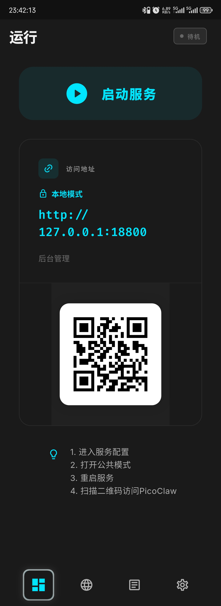
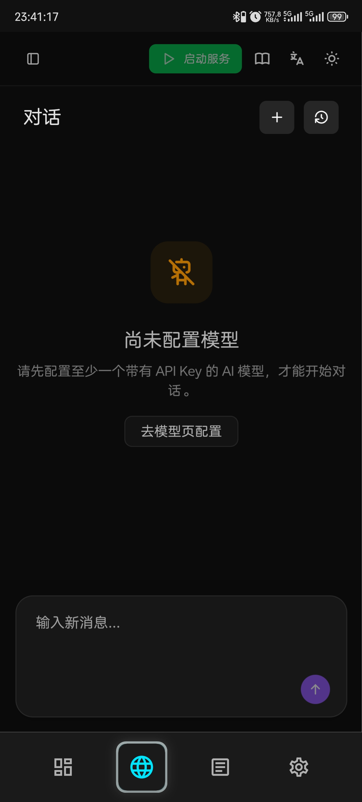
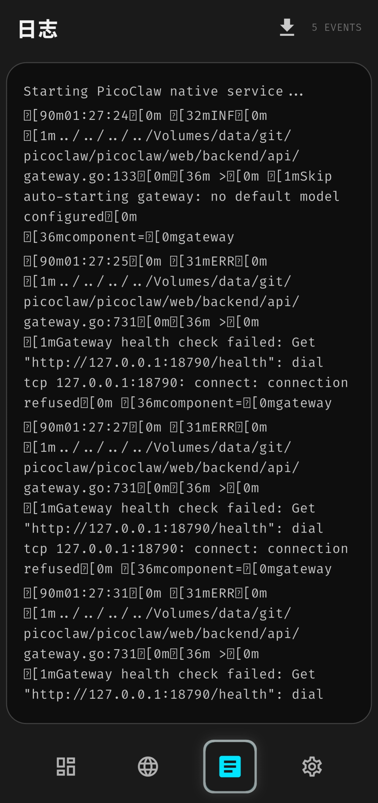
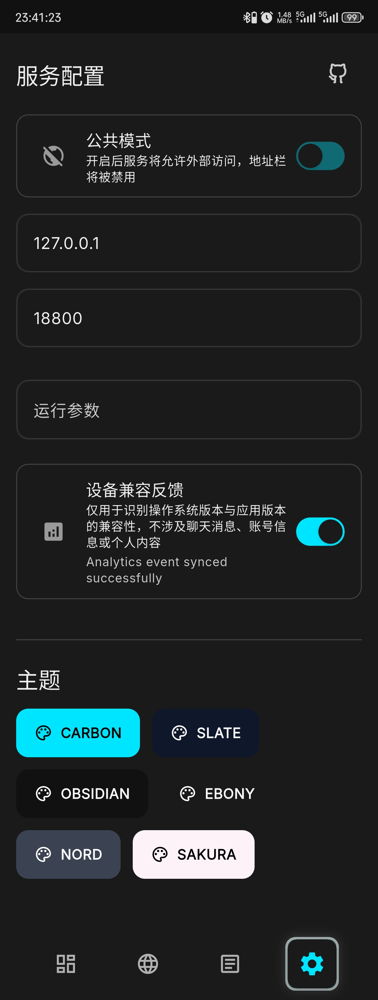

The wait is over — PicoClaw's native Android APK beta is here!

No more wrestling with Termux and manual installs. Just download the APK and you're running

Specially optimized for Android set-top boxes — clean UI, fully remote-control navigable

Wake up that dusty box in the corner and turn it into your home AI hub!

---

## Clean Interface, Remote-Friendly

**Home Screen: One-Tap Start**

Tap once to start the service. That's it.

**Page 2: Embedded Web UI**

No need to switch to a browser — the Web UI is embedded on page 2

Deploy, configure, chat — all in one place

Set-top box users: since typing with a remote is painful, we recommend scanning the QR code on page 1 with your phone for initial setup

Before you do that, make sure to enable **Public Mode** in settings

**Page 3: Runtime Logs**

Developer territory — dig through logs here when something goes wrong. Regular users can tap the ⏬ button in the top-right corner to save logs locally and share them directly with the community for help

**Page 4: Settings**

In most cases, you won't need to touch this at all

Want other devices on your local network to access PicoClaw? (e.g. your phone connecting to PicoClaw running on a set-top box)

Enable **Public Mode**, restart the service, done

---

## Which Devices Can Try It?

If you have an Android device nearby, chances are it'll work!

- **Phone**: Ultra-lightweight, barely touches performance, runs fully local — a private all-in-one AI assistant
- **Old phone**: Plug it in, tuck it in a corner, 24/7 online — no server costs, ever
- **Set-top box**: That box that only watches TV? Now it can do one more thing. Runs perfectly on 1 GB DDR + 8 GB eMMC. Minimum Android 7 — even a 10-year-old box works~
- **Tablet**: That dusty tablet becomes your home AI console

Other Android devices should work too — full compatibility testing is still in progress, feedback welcome

PicoClaw uses almost no memory and has minimal hardware requirements — old devices get a second life!

---

## How to Join the Beta

Download the APK from GitHub Releases and install it directly

When prompted about "unknown sources," just allow it — that's standard procedure for any APK outside the app store, no risk

→ https://github.com/sipeed/picoclaw_fui/releases

Run into issues? Report them on GitHub Issues or in the community group — help us improve compatibility together!

Device compatibility feedback thread: https://github.com/sipeed/picoclaw_fui/issues/42

---

## A Few Things to Know Before You Start

**You'll need your own API Key**

PicoClaw itself is free and open source, but calling AI models (DeepSeek, Qwen, Doubao, etc.) requires an API key from the respective platform

Most major providers offer subscription plans starting from a few dollars — enough for a regular user to last a long, long time

**This is a developer beta**

The current version hasn't completed full device compatibility testing and may have undiscovered issues

Not recommended for direct public internet exposure or critical workloads

A stable release will follow once testing is complete

---

## About PicoClaw

PicoClaw is an open-source AI assistant project initiated by Sipeed, written from scratch in Go — currently at 27K+ GitHub Stars

Supports conversation across 18+ platforms including WeChat, WeCom, Telegram, QQ, Feishu, DingTalk, and more

Web search, scheduling, coding, file handling, and extensible via MCP protocol

---

*PicoClaw — Lightweight, Cross-platform, Blazing Fast*

Website: picoclaw.io

GitHub: github.com/sipeed/picoclaw

Docs: docs.picoclaw.io

Discord: discord.gg/V4sAZ9XWpN
