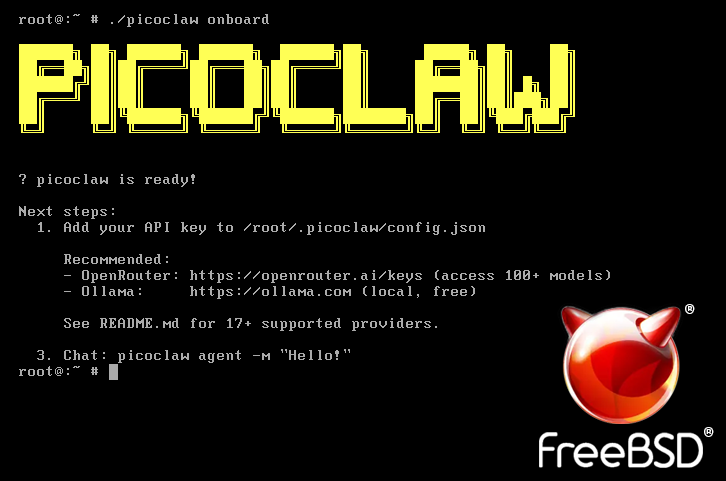

**March 17, 2026**  PicoClaw Team announces official FreeBSD and NetBSD support

Running BSD on your NAS, firewall, router, or embedded device? Now it can be your AI assistant too

---

## BSD Users Have Been Waiting for This

PicoClaw has supported Linux, macOS, and Windows from day one

Later came RISC-V, Loongson, and MIPS

But the BSD community never stopped asking:

"When will FreeBSD be supported?"

"Can it run on my pfSense/OPNsense firewall?"

"TrueNAS runs on FreeBSD under the hood — can I install it directly?"

Starting with v0.2.3, the answer is: **Yes**



---

## 6 Build Targets Covered

Precompiled binaries for BSD — ready to run, no build required:

| Platform | Architectures |
|----------|--------------|
| FreeBSD | x86_64 / arm64 / armv7 / armv6 |
| NetBSD | x86_64 / arm64 |

Fast download: picoclaw.io

Latest builds: github.com/sipeed/picoclaw/releases

No compilation needed, no Go environment required

Download, extract, run — three steps and you're done

---

## Why BSD Users Need PicoClaw

BSD systems have a massive installed base in servers and network appliances

These devices typically run 24/7, have limited resources, and aren't suited for heavy applications

PicoClaw fits perfectly:

- **10 MB memory footprint** — won't interfere with your NAS or firewall's main workload
- **Single binary deployment** — no dependencies, no runtime, just copy and run
- **Millisecond startup** — service resumes instantly after a reboot

Some typical use cases:

- **TrueNAS / FreeNAS**: Run an AI assistant on your NAS, remotely manage files and query storage status via Telegram
- **pfSense / OPNsense**: Deploy an AI ops assistant on your firewall for automated log analysis and alert forwarding
- **NetBSD embedded devices**: Run a lightweight agent on network appliances for automated health checks
- **Development servers**: BSD developers can finally use an AI assistant in their native environment

---

## Community Feedback

The BSD support launch got a strong reception in the international tech community. A few interesting highlights:

- Someone ran it on a 2012 HP MicroServer (FreeBSD 14) with only 8 MB memory usage
- Someone dropped it into a Raspberry Pi 4 + FreeBSD homelab gateway
- A developer in the NetBSD community is testing packaging PicoClaw into pkgsrc

The BSD community is known for technical depth, resource sensitivity, and preference for lightweight tools

PicoClaw's design philosophy is a natural fit

---

## Get Started in Three Steps

Using FreeBSD x86_64 as an example:

**Step 1: Download**

```sh
fetch https://github.com/sipeed/picoclaw/releases/latest/download/picoclaw_Freebsd_x86_64.tar.gz
```

> Note: NetBSD users should install wget via pkgin or use curl to download

**Step 2: Extract and Initialize**

```sh
tar xzf picoclaw_Freebsd_x86_64.tar.gz
./picoclaw onboard
```

**Step 3: Start Chatting**

```sh
./picoclaw agent
```

Want to connect Telegram, Discord, Feishu, or DingTalk?

Edit `~/.picoclaw/config.json` to configure the channels, then run `picoclaw gateway`

Full documentation: docs.picoclaw.io

---

## Full Platform Support

| Platform | Architectures |
|----------|--------------|
| Linux | x86_64, arm64, armv7, armv6, riscv64, loong64, mipsle, s390x |
| macOS | arm64 (Apple Silicon), x86_64 |
| Windows | x86_64, arm64 |
| FreeBSD | x86_64, arm64, armv7, armv6 |
| NetBSD | x86_64, arm64 |

35 precompiled packages in total — from $5 dev boards to enterprise servers

---

*PicoClaw — Lightweight, Cross-platform, Blazing Fast*

Website: picoclaw.io

GitHub: github.com/sipeed/picoclaw

Docs: docs.picoclaw.io

Discord: discord.gg/V4sAZ9XWpN
