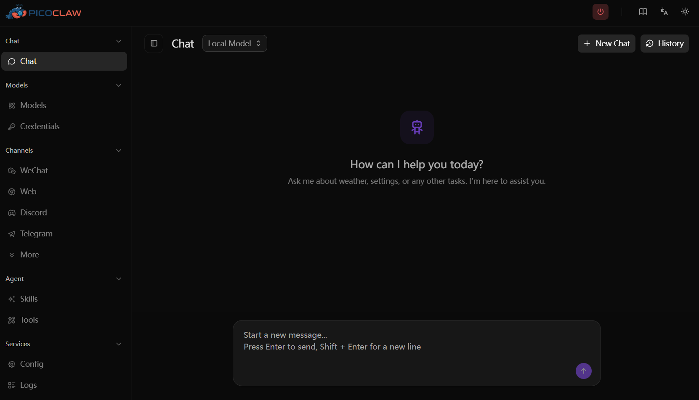

## What is PicoClaw?

**In one sentence: an ultra-lightweight AI assistant that runs on low-cost hardware.**

PicoClaw is written from scratch in Go. It uses less than 10MB of RAM, boots in under 1 second, and supports x86, ARM, RISC-V, and LoongArch architectures. You can deploy it on a Raspberry Pi, an old phone, a NanoKVM, or even a $9.9 LicheeRV-Nano — and chat with it through Telegram, Discord, WeChat, Feishu, DingTalk, QQ, and 18+ other platforms.

It is **not** a fork of OpenClaw. PicoClaw is an independent open-source project initiated by [Sipeed](https://sipeed.com).

Currently **26K+ Stars** on GitHub, with active contributions from developers worldwide.

## Quick Links

- 🏠 **Website & Download**: [picoclaw.io](https://picoclaw.io)
- 📖 **Documentation**: [docs.picoclaw.io](https://docs.picoclaw.io)
- 💻 **GitHub**: [github.com/sipeed/picoclaw](https://github.com/sipeed/picoclaw)
- 🗺️ **Roadmap**: [ROADMAP.md](https://github.com/sipeed/picoclaw/blob/main/ROADMAP.md)
- 📦 **Latest Builds**: [Releases](https://github.com/sipeed/picoclaw/releases)
- 💬 **Discord Community**: [discord.gg/V4sAZ9XWpN](https://discord.gg/V4sAZ9XWpN)

## Getting Started

**Download from:**
- Fast download → [picoclaw.io](https://picoclaw.io)
- Latest builds → [GitHub Releases](https://github.com/sipeed/picoclaw/releases)

### Option 1: Web Launcher (Recommended for Desktop)

Download, extract, and run `picoclaw-launcher` (or `picoclaw-launcher.exe` on Windows). Your browser will automatically open:

```
http://localhost:18800
```

Configure and chat right in the browser — no command line needed.



### Option 2: TUI Launcher (Recommended for Servers / SSH)

Download, extract, and run in your terminal:

```bash
picoclaw-launcher-tui
```

Full-featured terminal UI, perfect for headless devices (Raspberry Pi, servers, etc.).


### Option 3: Command Line

Three steps to get started:

1. Download the binary for your platform
2. Run `picoclaw onboard` to initialize
3. Start chatting with `picoclaw agent`


Want Docker? One command:

```bash
docker compose -f docker/docker-compose.yml up -d
```

Full tutorial → [docs.picoclaw.io](https://docs.picoclaw.io)

## What Can It Do?

- 🔍 Web search and information gathering
- 📅 Schedule management and reminders
- 💻 Write code, fix bugs, deploy projects
- 🗣️ Voice-to-text with auto-reply
- 🔌 MCP protocol for unlimited tool extensions
- 🤖 Spawn sub-agents for parallel multi-tasking

## Current Version: v0.2.4

- ✅ Agent architecture overhaul (Sub-turn concurrency, Hook system, Steering)
- ✅ WeChat personal account integration (scan to bind)
- ✅ WeCom channel complete rebuild
- ✅ Encrypted credential storage (.security.yml)
- ✅ Automatic sensitive data filtering
- ✅ New providers: AWS Bedrock, Azure OpenAI, and more
- ✅ Multi-key failover with virtual models
- ✅ TUI Launcher complete rewrite
- ✅ 35 bug fixes

## Stay Connected

Follow PicoClaw on WeChat:


What to expect from us:

- 📢 Version update announcements
- 📝 Tutorials and best practices
- 🎯 Community events and meetups
- 🌍 Global AI Agent industry news
- 💡 Developer stories and contribution guides

Questions? Ideas? Join our community or leave a comment below.

Let's Go, PicoClaw! 🦞
