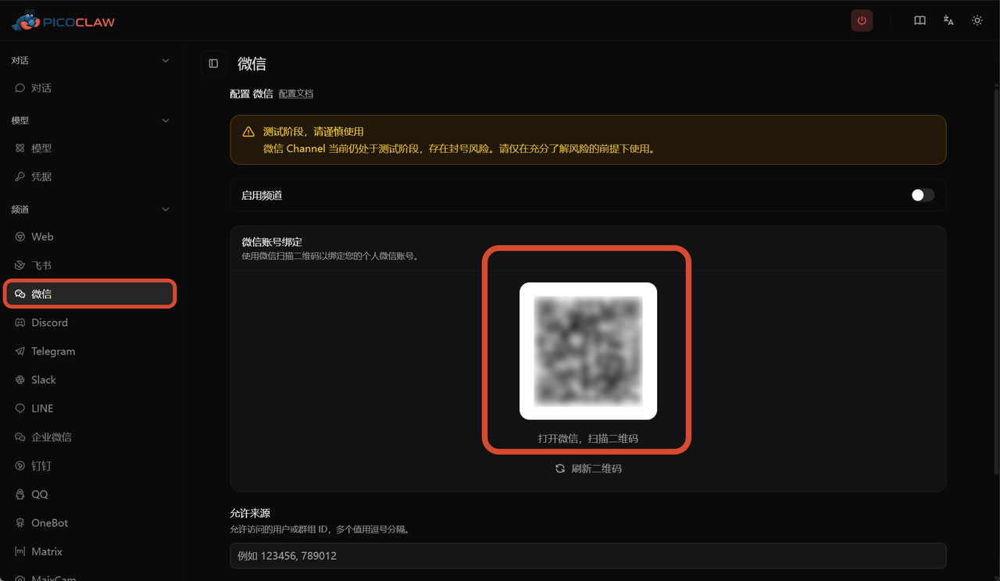
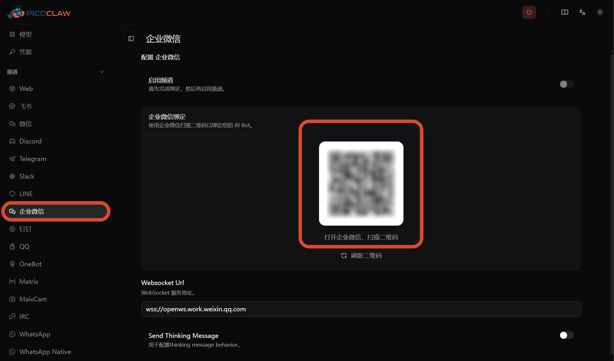

**March 25, 2026**  PicoClaw Team releases v0.2.4

This is a big update — big enough that we felt we had to explain it properly, or you might not even notice what changed

So this post focuses on one thing: **what this update means for you**

---

## 1. Your AI Assistant Can Now "Split Into Multiple"

Before, if you asked PicoClaw to do something complex — like "search for the latest AI news, summarize it into a report, then send it to me" —

It had to do everything one step at a time, and you had to wait

Not anymore

It can now dispatch multiple "mini assistants" working in parallel:

One searches, one summarizes, one sends

The main assistant keeps responding to you — no blocking

And more importantly:

🔍 You can check what each mini assistant is doing at any time

⛔ Something going wrong? Say the word and it stops immediately

🔄 Something broke? It can roll back to the previous state, no mess left behind

📊 Every conversation tracks how much "thinking" was used — no silent overruns

This mechanism is called **Sub-turn + Steering** — the most fundamental architectural upgrade in this release

You don't need to understand the technical details. Just know: **it's more capable now, and more obedient**

---

## 2. WeChat Is Finally Here

This is a feature many users in China have been waiting a long time for

Just click the "WeChat" channel in the web UI:



Or run one command in the terminal:

```
picoclaw auth weixin
```


Scan the QR code and your WeChat becomes an AI assistant portal

Send messages, receive replies, send images, send files — just like using WeChat normally, except the other side is AI

> ⚠️ One thing to be clear about: this feature uses Tencent's official API. Tencent has the ability to view conversation content. PicoClaw itself does not send your data to any third party, but we have no control over Tencent's access. Please make your own judgment before using this feature.

---

## 3. WeCom Got a Full Rebuild

If you use WeCom (Enterprise WeChat) at work, there's an important change:

Previously there were three separate WeCom configurations (`wecom`, `wecom_app`, `wecom_aibot`) — they've now been merged into one



The benefits: simpler configuration, more complete functionality, and streaming output support (characters appear one by one instead of waiting for the full response)

> ⚠️ If you previously configured WeCom, you'll need to migrate your config before upgrading, otherwise it will stop working.

---

## 4. Your Credentials Are Now Safer

Previously, PicoClaw stored everything — including your API keys and Bot Tokens — in `config.json`

If that file was accidentally shared, your keys were exposed

Now it's different:

🔐 All sensitive information is encrypted and stored separately in `.security.yml`

🙈 API keys in the web UI are masked by at least 40% — never shown in full

🚫 When the AI processes tool results, if it detects a key or password, it automatically replaces it with `[REDACTED]` — your sensitive data never gets fed to the model

📝 Bot Tokens in logs only show the first and last 4 characters

On the first launch after upgrading, PicoClaw will automatically migrate sensitive data from your old config — no manual action needed

---

## 5. Even More AI Models Supported

New additions this release:

| Added | In Plain English |
|-------|-----------------|
| AWS Bedrock | Amazon cloud AI — works with Claude, Llama, and more |
| Azure OpenAI | GPT on Microsoft Azure |
| Alibaba Qwen | Fast access in China, includes code-specialized versions |
| Novita AI | Another AI provider option |
| Baidu Qianfan AI Search | Baidu's AI search, fast access in China |

Also: you can now configure multiple API keys for the same model

If one key goes down, it automatically switches to the next — you won't feel any interruption

---

## 6. The Web Interface Got a Lot Better

Many settings that used to require editing config files can now be handled through the web UI:

✅ Chat directly from the home page — no need to navigate into submenus

✅ All channels managed in one page — toggle, configure, done

✅ See exactly which tools the AI called and what the results were, right in the chat interface

✅ Messages support mixed content — tables, code blocks, and images all render correctly

✅ WeCom and WeChat QR code binding done directly in the browser

---

## 7. Voice Features Got an Upgrade

- **ElevenLabs** speech-to-text support added
- Any AI model (e.g. GPT-4o Audio) can now be used for voice transcription
- Telegram can now send voice message replies

---

## 8. A Bunch of Bugs You May Have Hit — Fixed

- ✅ Telegram bot stuck showing "typing" forever — fixed
- ✅ WeChat sometimes failing to load — fixed
- ✅ API key not saving — fixed
- ✅ Some AI models returning blank responses — fixed
- ✅ QQ long voice file processing failure — fixed
- ✅ Feishu message tables not displaying fully — fixed
- ✅ Tool call failure crashing the entire assistant — fixed
- ✅ Model round-robin starting from the wrong position — fixed

35 bug fixes in total

---

## Things to Be Aware Of

**Please back up your `config.json` before upgrading.**

Several config structures changed in this release:

1. The `wecom_app` and `wecom_aibot` config blocks have been removed — migration required
2. The legacy `providers` config format is no longer supported — switch to `model_list`
3. The Feishu channel no longer supports 32-bit devices

If things are working fine for you right now, back up first, then upgrade

---

## One-Line Summary

v0.2.4 makes PicoClaw **more capable** (parallel agents), **more secure** (encrypted keys + auto-redaction), and **easier to use** (WeChat support + improved web UI) — it's a release worth upgrading to

---

*PicoClaw — Lightweight, Cross-platform, Blazing Fast*

Website: picoclaw.io

GitHub: github.com/sipeed/picoclaw

Docs: docs.picoclaw.io

Discord: discord.gg/V4sAZ9XWpN
