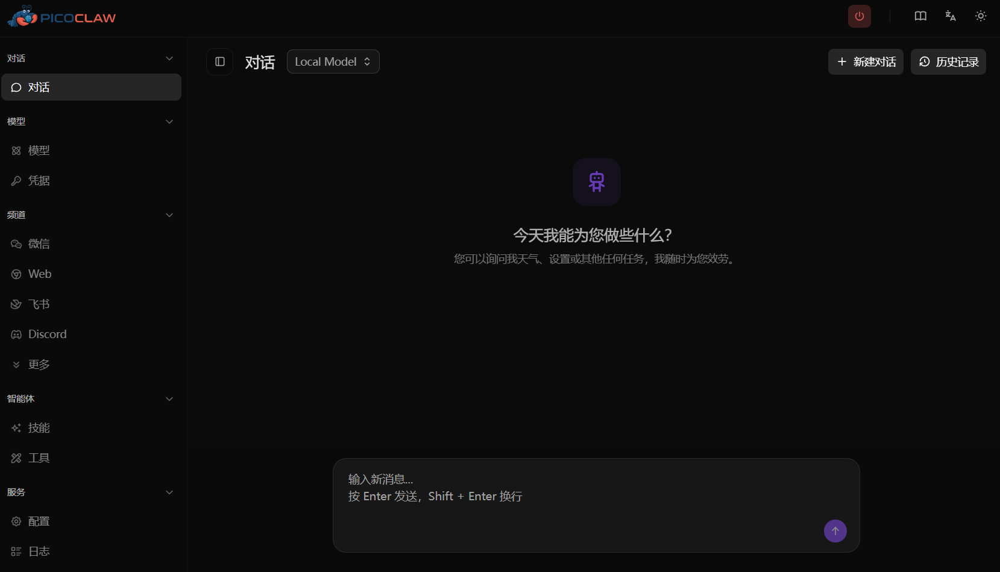
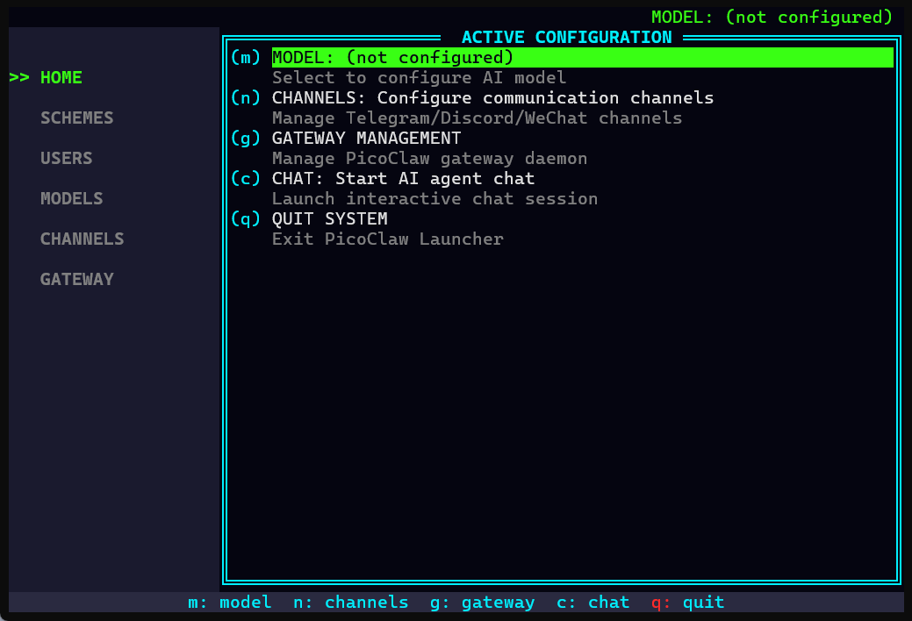
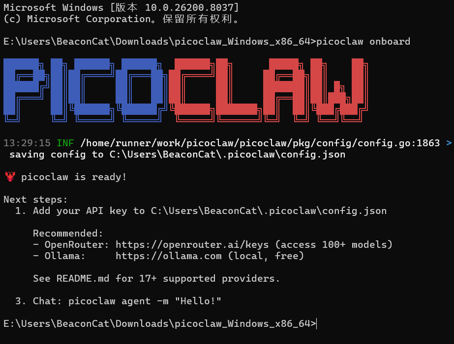

## PicoClaw 是什么？

**一句话：跑在低成本硬件上的超轻量 AI 助手**

PicoClaw 用 Go 语言从零编写，内存占用不到 10MB，启动不到 1 秒，支持 x86、ARM、RISC-V、龙芯等架构。你可以把它部署在树莓派、旧手机、NanoKVM，甚至一块 9.9 美元的 LicheeRV-Nano 上，通过 Telegram、Discord、微信、飞书、钉钉、QQ 等 18+ 平台和它对话。

它不是 OpenClaw 的分支，是矽速科技 (Sipeed) 发起的**独立开源项目**

目前 GitHub **27K+ Stars**，全球开发者活跃贡献中

## 快速链接

- 🏠 **官网 & 高速下载**：[picoclaw.io](https://picoclaw.io)
- 📖 **文档**：[docs.picoclaw.io/zh-Hans/docs](https://docs.picoclaw.io/zh-Hans/docs)
- 💻 **GitHub**：[github.com/sipeed/picoclaw](https://github.com/sipeed/picoclaw)
- 🗺️ **路线图**：[ROADMAP.md](https://github.com/sipeed/picoclaw/blob/main/ROADMAP.md)
- 📦 **最新构建**：[Releases](https://github.com/sipeed/picoclaw/releases)
- 💬 **Discord 社区**：[discord.gg/V4sAZ9XWpN](https://discord.gg/V4sAZ9XWpN)

## 快速上手

**下载地址：**
- 高速下载 → [picoclaw.io](https://picoclaw.io)
- 最新构建 → [GitHub Releases](https://github.com/sipeed/picoclaw/releases)

### 方式一：Web Launcher（推荐桌面用户）

下载后解压并运行 `picoclaw-launcher`（Windows 上为 `picoclaw-launcher.exe`），浏览器自动打开：

```
http://localhost:18800
```

在网页上完成配置和对话，无需命令行



### 方式二：TUI Launcher（推荐服务器 / SSH 用户）

下载后解压并在终端运行：

```bash
picoclaw-launcher-tui
```

全功能终端界面，适合无图形界面的设备（树莓派、服务器等）



### 方式三：命令行

三步开始：

1. 下载对应平台的二进制文件
2. 运行初始化 `picoclaw onboard`
3. 开始对话 `picoclaw agent`



想用 Docker？一行命令搞定：

```bash
docker compose -f docker/docker-compose.yml up -d
```

详细教程看这里 → [docs.picoclaw.io/zh-Hans/docs](https://docs.picoclaw.io/zh-Hans/docs)

## 能做什么？

- 🔍 联网搜索，帮你整理信息
- 📅 管理日程，定时提醒
- 💻 写代码、改 bug、部署项目
- 🗣️ 语音转文字，自动回复
- 🔌 接入 MCP 协议，扩展无限工具
- 🤖 派生子 Agent，并行处理多任务

## 当前版本：v0.2.4

- ✅ Agent 架构重构（Sub-turn 并发、Hook 系统、Steering 干预）
- ✅ 微信个人号接入（扫码绑定）
- ✅ 企业微信渠道全面重构
- ✅ 凭据加密存储（.security.yml）
- ✅ 敏感数据自动过滤
- ✅ AWS Bedrock / Azure OpenAI 等新 Provider
- ✅ 多 Key 故障转移与虚拟模型
- ✅ TUI Launcher 全面重写
- ✅ 35 项 Bug 修复

## 关注我们

扫码关注 PicoClaw 微信订阅号：


这个订阅号会发什么：

- 📢 版本更新速递
- 📝 使用教程和最佳实践
- 🎯 社区活动和线下 Meetup
- 🌍 全球 AI Agent 行业动态
- 💡 开发者故事和贡献指南

有问题？有想法？欢迎在评论区留言，或加入我们的社区群聊

皮皮虾，我们走！🦞
