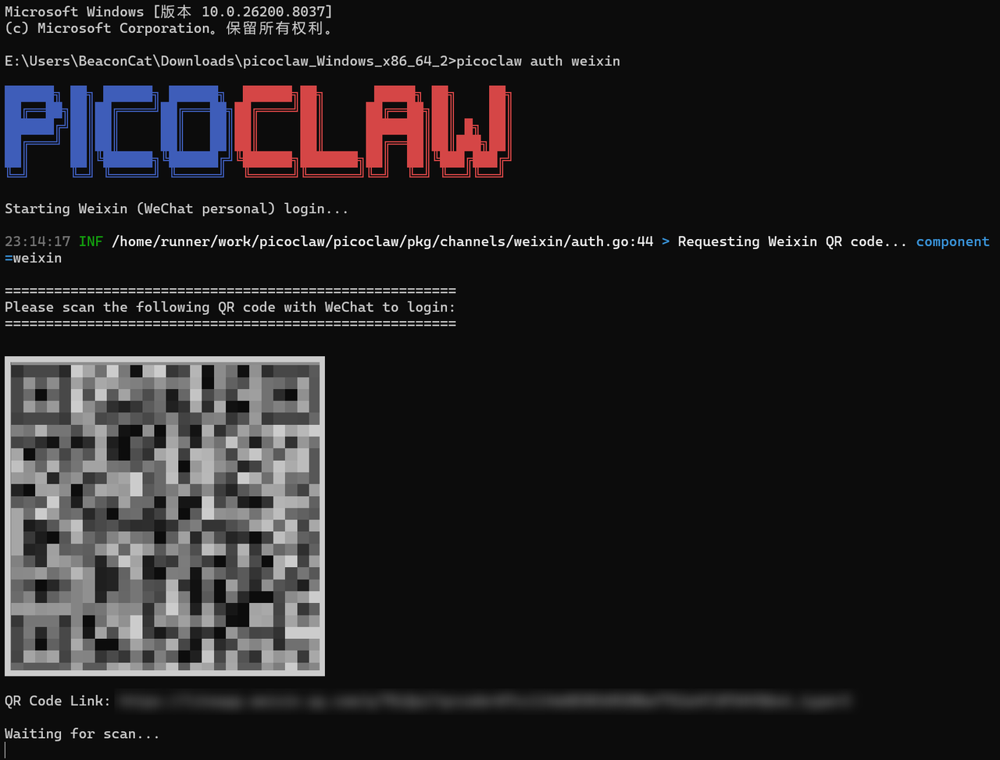
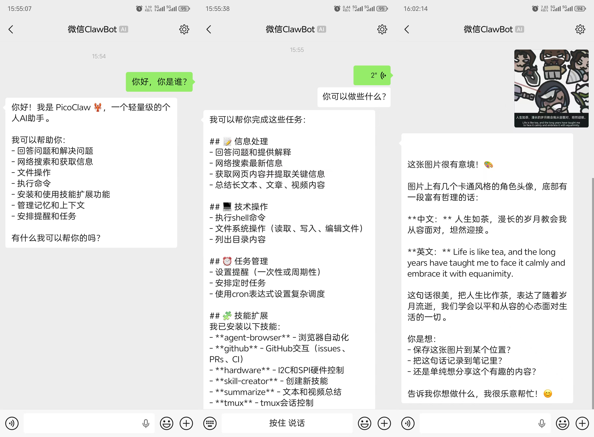

**2026 年 3 月 25 日**  PicoClaw 团队宣布微信接入正式可用

你的 AI 助手，现在可以直接在微信里跟你聊天了

---

## 微信 + PicoClaw = ？

从 Discord 到 QQ，从钉钉到飞书，PicoClaw 已经接入了 18 个聊天平台

但国内用户问得最多的一个问题始终是：

"微信什么时候能用？"

现在，答案来了

PicoClaw 正式支持微信个人号接入！

不需要企业微信，不需要公众号，不需要服务号——

用你自己的微信号，扫个码就能把 PicoClaw 变成你的微信 AI 助手

并且，所有对话都在本地处理，不经过任何第三方服务器

---

## 两步搞定

整个过程不到一分钟。

现在只需要在网页端点击「微信」频道


或在命令行输入一行命令：

```
picoclaw auth weixin
```



扫个码，你的微信就变成了 AI 助手的入口

如提示需要更新，按指引操作即可

**搞定！**



和新来的 ClawBot 打个招呼？——PicoClaw 会自动回复

---

## 能做什么

和其他平台的体验完全一致：

- 日常对话、问答、翻译
- 联网搜索，获取实时信息
- 文件处理、代码生成
- 定时提醒、日程管理
- 通过 MCP 协议扩展更多能力——如让 AI 实时查询股价、搜索最新技术文档，或者接入你自己的工具和服务

你在 QQ 上能用的功能，微信里一样能用

---

## 注意事项

- 当前功能官方正在逐步推送，若尝试文中操作仍不可用，请进群交流或稍作等候
- 微信 ClawBot 插件是腾讯官方提供的能力，PicoClaw 通过官方 API 接入
- 为确保信息安全，建议在自己的设备上运行 PicoClaw
- 该功能目前仅支持个人用途，暂不支持分享给他人或在群聊中使用

---

*PicoClaw — 轻量、跨平台、极速*

官网：picoclaw.io

GitHub：github.com/sipeed/picoclaw

文档：docs.picoclaw.io

Discord 社区：discord.gg/V4sAZ9XWpN
